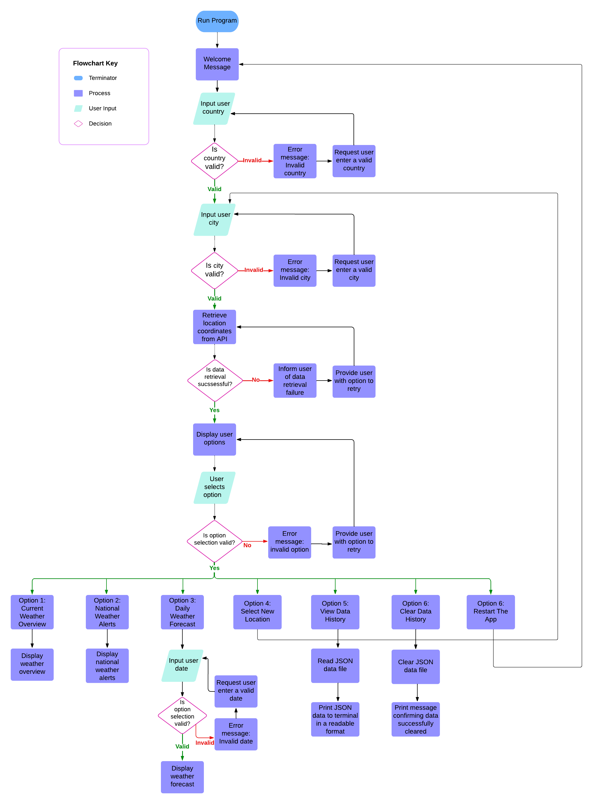

# **PP3 - Title** 

 

# **Introduction**
Deployed website can be be found here:

# Table of Contents

- [Design](#design)
	- [Colours](#colours)
- [User Experience - UX](#user-experience---ux)
	- [User Stories](#user-stories)
- [Logic](#logic)
	- [Flow Charts](#flow-charts)
- [Features](#features)
	- [Navigation](#navigation)
- [Testing](#testing)
    - [General App Testing](#general-app-testing)
    - [PEP8 Validator Service](#pep8-validator-service)
    - [Google Chrome Lighthouse Tool](#google-chrome-lighthouse-tool)
    - [Unfixed Bugs](#unfixed-bugs)
- [Deployment](#deployment)
    - [Deployment Steps](#deployment-steps)
    - [Forking Steps](#forking-steps)
    - [Cloning Steps](#cloning-steps)    
- [Technologies Used](#technologies-used)
	- [Languages Used](#languages-used)
    - [Python Packages](#python-packages)
	- [Frameworks - Libraries - Programs Used](#frameworks---libraries---programs-used)
- [Credits](#credits)
	- [Content Sources](#content-sources)
    - [Information Resources](#information-resources)
    - [Special Thanks](#special-thanks)

## **Design**

### **Colours**

## **User Experience - UX**

### **User Stories**

## **Logic**

### **Flow Charts**

[LucidChart](https://www.lucidchart.com/) was used create a flowchart to visualise the programming sequence.

## **Features**

### **Navigation**

## **Testing**

### **General App Testing**

### **PEP8 Validator Service**

### **Google Chrome Lighthouse Tool**

### **Unfixed Bugs**

## **Deployment**

This website was deployed to Heroku.

### **Deployment Steps**

### **Forking Steps**

### **Cloning Steps**

## **Technologies Used**

### **Languages Used**
- 

### **Python Packages**

### **Frameworks - Libraries - Programs Used**

-  - Version control system used to track file versions within the project.
-  - Cloud-based version control developer platform used in this project to host the repository, manage code and track code changes.
-  - Connected to GitHub, GitPod hosted the coding space, allowing the project to be built and then committed to the GitHub repository. Used for version control. 
-  - Cloud platform used to deploy the live project.
-  - Web-based diagramming application used to create the flowchart which will visualise the project code excecution process.
-  - Open-source Javascript runtime environment used for asynchronous programming.
-  - Python style checker used to validate all the Python code within the project.
-  - Code editor platform used to create and edit the project code.

## **Credits**

### **Content Sources**

### **Information Resources**

### **Special Thanks**