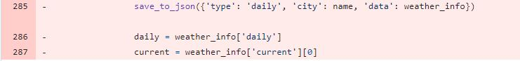

# **WeatherWise** 

 

# **Introduction**

Portfolio Project 2 - Code Institute Full Stack Development Diploma

WeatherWise is a Python-based command line application that offers current, daily and historic weather insights based on the user's location. The application utilises API to retrieve up-to-date accurate weather data and runs via a mock terminal on Heroku. JSON is used in this project to retrieve, parse and present weather API data to the user.

WeatherWise was designed as an ultra-efficient solution for users who require access to weather information at a moments notice. The no-frills, data-driven interface eliminates elements typical of a traditional weather info site which can hinder data delivery speed and negatively impact the user experience, such as: ads, slow-loading graphics, unrelated content, cookies and complex navigation menus.

Deployed website can be be found here: [WeatherWise App](https://weather-wise-app-7e6e2cb6b2e0.herokuapp.com/)

# Table of Contents

- [Design](#design)
	- [Colours](#colours)
- [User Experience - UX](#user-experience---ux)
	- [User Stories](#user-stories)
- [Logic](#logic)
	- [Flow Charts](#flow-charts)
- [Features](#features)
	- [Introduction Message](#introduction-message)
    - [Navigation](#navigation)
    - [Current Weather](#current-weather)
    - [Daily Weather Forecast](#daily-weather-forecast)
    - [Weather Alerts](#weather-alerts)
    - [Save Weather Data History](#save-weather-data-history)
    - [Future App Improvements](#future-app-improvements)
- [Testing](#testing)
    - [General App Testing](#general-app-testing)
    - [PEP8 Validator Service](#pep8-validator-service)
    - [Google Chrome Lighthouse Tool](#google-chrome-lighthouse-tool)
    - [Testing Issues](#testing-issues)
    - [Unfixed Bugs](#unfixed-bugs)
- [Deployment](#deployment)
    - [Deployment Steps](#deployment-steps)
    - [Forking Steps](#forking-steps)
    - [Cloning Steps](#cloning-steps)    
- [Technologies Used](#technologies-used)
	- [Languages Used](#languages-used)
    - [Python Libraries](#python-libraries)
	- [Frameworks And Programs Used](#frameworks-and-programs-used)
- [Credits](#credits)
	- [Content Sources](#content-sources)
    - [Information Resources](#information-resources)
    - [Special Thanks](#special-thanks)

## **Design**

### **Colours**

The [Colorama](https://pypi.org/project/colorama/) library was imported into the project and used to produce coloured terminal text. Additional colors were utilised in order to improve readability and user experience.

The following colors were used:
- Cyan - used for the welcome message and input requests to the user (e.g. 'Please enter your city'). As cyan is a particularly bright colour it provides a high level of contrast agains the black terminal background and therefore has a high level of readability.
- Green - used for weather data results such as current weather stats, the color shade is also fairly bright to provide a good level of readability.
- Blue - used to convey rain information to the user as the colour is often associated with rain.
- Red - used to alert the user of any errors, such as 'Invalid date format. Please use DD/MM/YYYY'.

Colorama 'BRIGHT' style was also used to increase the thickness of certain terminal text.

Below - Colorama full color palette chart:

## **User Experience - UX**

### **User Stories**

As a user, I wish to:

- Immediately understand the purpose of the application, so I can quickly determine if it meets my needs.
- Receive clear feedback on invalid inputs, so I can quickly correct my entries and proceed with using the application.
- Input my country and city easily, so I can get localized weather information relevant to my area.
- View the current weather forecast, so I can plan my immediate activities accordingly.
- See the daily weather forecast, so I can plan my week and make informed decisions about upcoming events.
- Be notified of any national weather alerts, so I can stay safe and prepared for potential severe weather conditions.
- Access historical weather data, so I can compare current conditions with past trends and make long-term plans.
- Use a simple and intuitive interface, so I can navigate the application easily without needing extensive instructions.

As a developer, I wish to: 

- Access a README file so that I can understand the scope and purpose of the project and locate essential information regarding the application
- Access deployment information so I can follow step-by-step instructions on how to deploy the project
  

## **Logic**

### **Flow Charts**

[LucidChart](https://www.lucidchart.com/) was used create a flowchart to visualise the programming sequence.

## **Features**

### **Introduction Message**
The 'WeatherWise' app name was chosen in order to immediately convey the purpose of the app as simple but efficient weather forecasting tool. Upon loading, the WeatherWise application displays the app logo (created using ASCII art), a message welcoming the user and a prompt requesting the user enter a city name.

The app then advises the user of how to format their search terms for increased specificity (by inputting 'CITY, STATE, COUNTRY') and shows an example of this format to provide further context to the user.

### **Navigation**
The application navigation function is handle by an options menu which provides the user 7 different options from which to select. The options menu is only displayed once a valid city has been selected by the user and this is confirmed via a notification message which prints out the geographical coordinates of the chosen location.

These options include the ability to view a range of weather forecast types, choose a new city, restart the program and view or clear the user's weather data history from the WeatherWise app. The options menu is designed to have clearly defined options which are straightforward to navigate and provide the user with feedback if an error arises.

The program validates the user input within options menu function, to check whether a valid value has been entered. If the input is not valid, an appropriate error message will then notify the user and prompt them to try again, e.g. 'Invalid option. Please enter a number between 1 and 7.'

### **Current Weather**

### **Weather Alerts**

### **Daily Weather Forecast**

### **Save Weather Data History**

### **Future App Improvements**
- With additional development time I would like to implement an IP filtering function into the application, which would enable each users IP address to be checked and their respective JSON weather history data values to be allocated to the corresponding IP address. Returning users who load the app would have their past weather data retrieved by matching their IP to the accompanying weather data, in the case that a match was located.

- I would also like to implement a function to allow the user to enter a historic date in time and retrieve the weather for that specific day for their chosen location.

## **Testing**

### **General App Testing**

|              App Element              |                                                             Action (if applicable)                                                            |                                                                                                           Expected Outcome                                                                                                           | Result |
|:-------------------------------------:|:---------------------------------------------------------------------------------------------------------------------------------------------:|:------------------------------------------------------------------------------------------------------------------------------------------------------------------------------------------------------------------------------------:|:------:|
|                Terminal               |                                                            Start up command is run                                                            |                                                                                        WeatherWise app welcome message is printed to terminal.                                                                                       |  Pass  |
|                Terminal               |                                                            Start up command is run                                                            |                                                                                              Input city request is printed to terminal.                                                                                              |  Pass  |
|               City Input              |                                                  Click on terminal cursor and then type text                                                  |                                                                                                User is able to input data to the app.                                                                                                |  Pass  |
|               City Input              |                                              Input "" or " " as city name input and click 'Enter'                                             |                                                                                                 Error message is printed to terminal.                                                                                                |  Pass  |
|               City Input              |                                              Input a invalid value (not a geographical city name)                                             |                                                                                                 Error message is printed to terminal.                                                                                                |  Pass  |
|               City Input              |                                                            Enter a valid city name                                                            | Confirmation message confirming city name, state and country, aswell as city geographical coordinates are printed to terminal (e.g. Your location is Paris, Ile-de-France, FR.  Latitude: 48.8588897 Longitude: 2.3200410217200766). |  Pass  |
|               City Input              |                 User enters a city which does not have a 'state' value according to OpenWeather API, e.g. Monaco, Berlin etc.                 |                                                             'State' value is not included in the print message. City name, country and coordinates are printed as normal.                                                            |  Pass  |
|              Options Menu             |                                                     City input value is confirmed as valid                                                    |                                                    Options menu is displayed which lists all 7 options and prompts the user to enter a number 1-7 to incidate their chosen option.                                                   |  Pass  |
|              Options Menu             |                 Input an invalid value that is not a number between 1 and 7 (e.g. alphabetic letters, numbers 8+, empty value)                |                                                                          Error message is printed: 'Invalid option. Please enter a number between 1 and 7'.                                                                          |  Pass  |
|       Option 1 - Current Weather      |                                                            Input integer value '1'                                                            |                                                      Current weather forecast stats and summary for the selected city is printed to the terminal, followed by the options menu.                                                      |  Pass  |
|       Option 2 - Weather Alerts       |                                                            Input integer value '2'                                                            |                        Any current weather alerts for the chosen city are printed. If there are no current weather alerts then a message is printed to confirm this. Options menu is then printed to terminal.                       |  Pass  |
|      Option 3 - Weather Forecast      |                                                            Input integer value '3'                                                            |                                                        User is prompted to input a date to view the weather forecast, up to 8 days from the present day (in DD/MM/YYYY format)                                                       |  Pass  |
|      Option 3 - Weather Forecast      |                                  Input a valid date (up to 8 days from the present day) in DD/MM/YYYY format                                  |                                                  Weather forecast stats and summary for the selected city and date are displayed. Options menu is displayed below this information.                                                  |  Pass  |
|      Option 3 - Weather Forecast      |                                        Input either the date of the present day or a date from the past                                       |                                                                Error message is displayed: 'Error: Please enter a date within 8 days from today and not in the past.'                                                                |  Pass  |
|      Option 3 - Weather Forecast      |                                             Input a date not in DD/MM/YYYY format (e.g. 18/09/24)                                             |                                                                               Error message is displayed: 'Invalid date format. Please use DD/MM/YYYY'.                                                                              |  Pass  |
|    Option 4 - Choose A New Location   |                                                            Input integer value '4'                                                            |                                                                User is taken back to the input city option and is prompted to input a new city name into the terminal.                                                               |  Pass  |
|  Option 5 - View Weather Data History |                                                            Input integer value '5'                                                            |                         All weather data that has been generated by the user is printed to the terminal in the order they were retrieved. Options menu is re-printed to terminal. JSON file is also cleared.                         |  Pass  |
| Option 6 - Clear Weather Data History |                                                            Input integer value '6'                                                            |                            Weather data is cleared and a confirmation is printed to the terminal to notify the user: 'Weather data history cleared successfully.' Options menu is re-printed to terminal.                            |  Pass  |
|         Option 7 - Start Over         |                                                            Input integer value '7'                                                            |                                          A confirmation message notifies the user: 'Restarting WeatherWise application...'. Then the user is prompted to enter a city name of their choice.                                          |  Pass  |
|      JSON File (weather_history)      | User retrieves current weather or forecast weather information during the course of using the application and this is printed to the terminal |                                                                                           Data is saved to the 'weather_history' JSON file                                                                                           |  Pass  |

### **PEP8 Validator Service**

The [pycodestyle](https://pypi.org/project/pycodestyle/) Python tool (formerly called PEP8) was used to check run.py for PEP8 style conventions compliance and flag any issues found in the file. All issues flagged by the tool were dealt with and the tool was re-run and showed no issues in the file.

Below: screenshot of result after running pycodestyle in the terminal, no errors appear:

### **Google Chrome Lighthouse Tool**

Google Chrome Lighthouse Tool was used to test performance, accessibility, best practices and SEO of the WeatherWise application on desktop. Here are the test results:

### **Testing Issues**

Issue 1

During testing of the application I inputted 'Monaco' for the city value input and had the error message below returned in terminal. Looking at the error message I determined that the error had arisen because the API response for 'Monaco' did not have a 'state' key associated with it, unlike the majority of other cities.

To fix this bug I modified the geocode_city function to be able to handle instances where the chosen city does not have a 'state' key present. I amended the function code so that if no 'state' key is present, the program will default to "N/A" instead of raising a KeyError. I also modified the 'location_str' variable to include an if statement which will remove the state key from the print message if the city state is 'N/A'.

These actions fixed the bug and after implementing them the function worked correctly when 'stateless' cities were inputted by the user.

Below - screenshot of the 'state' bug error message encountered:

Issue 2

When testing the deployed version of the WeatherWise app, after selecting option 3 from the options menu (to select a date to display the weather forecast) and entering a random date, I received the following error message:

Traceback (most recent call last): 
File "/app/run.py", line 374, in <module> main() 
File "/app/run.py", line 367, in main actions[choice](latitude, longitude, city_name) 
File "/app/run.py", line 287, in forecast_weather current = weather_info['current'][0] ~~~~~~~~~~~~^^^^^^^^^^^ KeyError: 'current'

After lots of trial and error I determined the 'current' variable was not needed within the forecast_weather function which handles data retrival of weather forecast for a specified date in the future. I removed the current variable from the function and also amended the index for accessing the daily forecast data as this was incorrect. These changes sorted out the issue and upon testing the function again, the correct expected output was generated by the program.

Below - the python code causing the bug:

Below - the corrected code:

Issue 3

During testing the deployed application I encountered the following FileNotFound error message:

After checking my api_key I realised that the issue was being caused because my API key within my api_key.txt file had not been assigned to a variable name and was therefore not being retrieved by the program. Only the API key itself was inside the file, but this should have been formatted as 'e.g. api_key = ughif93757669444'. After making this correction the api_key element was linked properly and the program ran as expected without error.

Issue 4

When I ran my run.py code through the 'pycodestyle' tool to check that my code conforms to PEP8 style standards I found that there were a few 'E501 line too long' errors. After attempting to split the line of code below I found that the new format of the code had caused the print message to split onto a new line also. I hadn't intended for this and wanted to split the line in the code but keep the print message on a single line. 

Below - code causing the formatting issue

A quick Google search revealed to me that the correct way to split f strings across multiple would be to start each subsequent line with an 'f' which should be aligned correctly with the f-string above it. 

After implementing this fix (shown in the code below) and running the program, the code ran correctly with the print message being on a single line and the actual code being split among several lines to reduce line length.

### **Unfixed Bugs**

As far as I am aware these are no unfixed bugs within this project.

## **Deployment**

### **Deployment Steps**
Deploy this project using the following steps:

#### **Heroku Log In**
1. Log in to [Heroku](https://id.heroku.com/login) or create a new Heroku account [here](https://signup.heroku.com/).
2. Click 'Create New App' and enter a unique app name.
3. Select your region from the drop-down menu.
4. Click on the 'Create App' button.

#### **Adjust Settings**
5. Navigate to the 'Settings' tab.
6. Scroll down to 'Config Vars' and select 'Reveal Config Vars'.
7. Type 'PORT' into the key box and '8000' into the value box, then click 'Add'.
8. Enter a second config var: enter 'CREDS' into the key box, copy and paste the contents of your creds.JSON file into the value box, then click 'Add'.
9. Scroll down to 'Buildpack'and click 'Add Buildpack'.
10. Select 'Python' and click 'Save Changes'.
11. Select 'NODE.js' and click 'Save Changes (note: buildpacks must be in this order).

#### **Deploy Application**
12. Click on the 'Deploy' tab and select 'GitHub'.
13. Confirm you wish to connect to GitHub.
14. Search for the repository name and then click 'Connect'.
15. Scroll down and either select 'Enable Automatic Deploys' (for automatic deployment of any changes made to GitHub repository) or select 'Deploy Branch' (for manual deployment).

### **Forking Steps**
Fork this project using the following steps:
1. Open the respository at [PP3 Github](https://github.com/k-nadia/project-3).
2. Select the 'Fork' button near the top of the page.
3. After a few minutes the newly forked repository will be created under your GitHub account.

### **Cloning Steps**
Clone this project using the following steps:
1. Open the respository at [PP3 Github](https://github.com/k-nadia/project-3).
2. Select the green 'Code' button near the top of the page.
3. Choose from one of the 3 cloning options: HTTPS, SSH, GitHub CLI.
4. Click on the clipboard icon to copy the URL.
5. Open a new GitPod terminal.
6. Type 'git clone' and paste in the URL copied earlier.
7. Press enter to complete the cloning process. 

## **Technologies Used**

### **Languages Used**
- 

### **Python Libraries**
- [Colorama:](https://pypi.org/project/colorama/) enables coloured text display in the terminal
- [DateTime:](https://pypi.org/project/DateTime/) provides DataTime data type
- [PPrint:](https://docs.python.org/3/library/pprint.html) enables python output to be properly formatted 
- [Requests:](https://pypi.org/project/requests/) allows HTTP requests to be sent
- [Dotenv:](https://pypi.org/project/python-dotenv/) handes Python environment variables

### **Frameworks And Programs Used**

-  - Version control system used to track file versions within the project.
-  - Cloud-based version control developer platform used in this project to host the repository, manage code and track code changes.
-  - Connected to GitHub, GitPod hosted the coding space, allowing the project to be built and then committed to the GitHub repository. Used for version control. 
-  - Cloud platform used to deploy the live project.
-  - Web-based diagramming application used to create the flowchart which will visualise the project code excecution process.
-  - Open-source Javascript runtime environment used for asynchronous programming.
-  - Python style checker used to validate all the Python code within the project.
-  - Code editor platform used to create and edit the project code.

## **Credits**

### **Content Sources**

- Geographical data, coordinates and city location information provided by OpenWeather [Geocoding API](https://openweathermap.org/api/geocoding-api)
- Current weather information and daily weather forecast data provided by the OpenWeather [One Call API 3.0](https://openweathermap.org/api/one-call-3#current)
- The WeatherWise ASCII logo was created using Patorjk ['Text to ASCII Art Generator' (TAAG)](https://patorjk.com/software/taag/) software

### **Information Resources**

- GET Request tutorial from [Medium](https://medium.com/@yash.tewani.nyc/get-request-with-stackoverflow-api-using-a-python-script-and-postman-f6d34b3f6f57)
- Python data structure tutorial from [Python](https://docs.python.org/3/tutorial/datastructures.html)
- API key hiding tutorial from [Puppy Coding](https://puppycoding.com/2023/07/02/hide-api-keys-python/)
- Follow up API key tutorial from [Puppy Coding](https://puppycoding.com/2023/07/06/hide-api-keys-deploy-server/)

### **Special Thanks**

Special thanks to my mentor Diego Pupato for your guidance and support throughout this project.